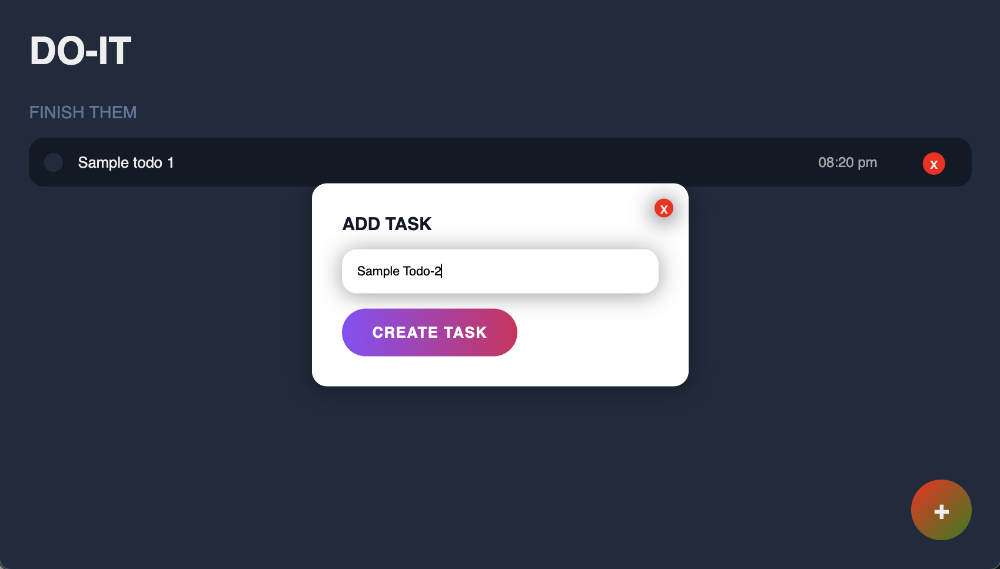
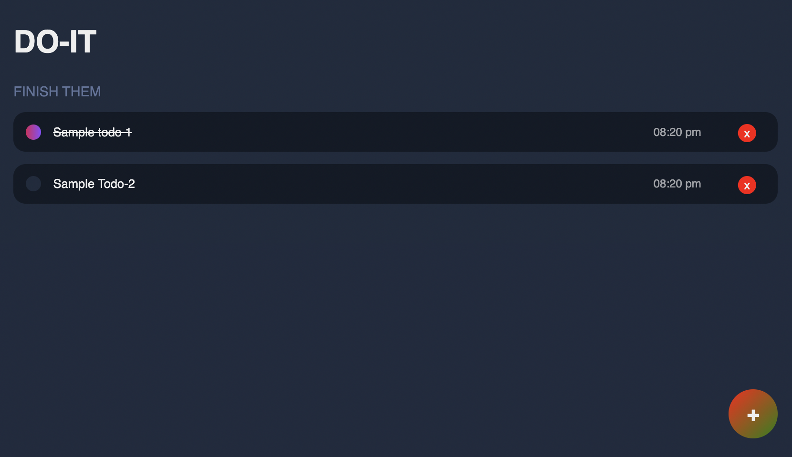
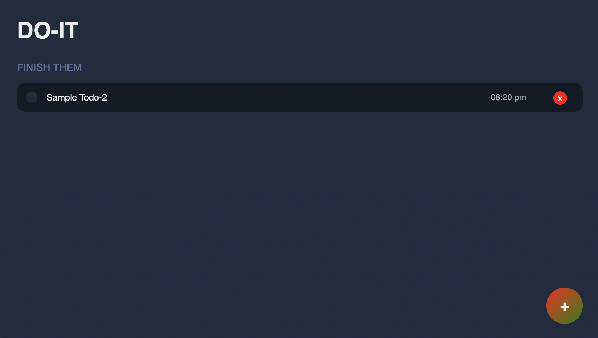

# Do-it, ToDo-List Application

This project is a simple task-logging application developed using the MERN stack. The app allows users to manage their tasks by adding, completing, and deleting to-do items.

## Features

* Add new tasks with the timestamp and the options to complete or delete them.
* Mark tasks as complete or incomplete.
* Real-time updates to the to-do list using React and MongoDB.

#### Create task pop-up:

#### Strikes the completed tasks by clicking :

#### Delete the tasks using cross:

## Tech-Stack used :
  
  
  
  
  
  
  
